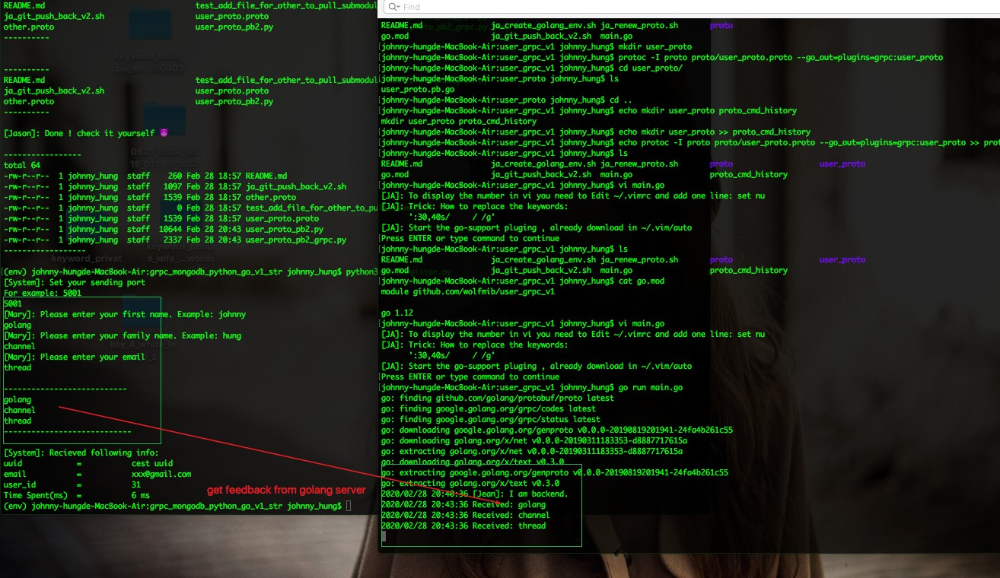
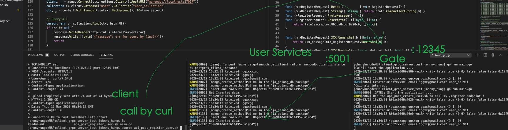
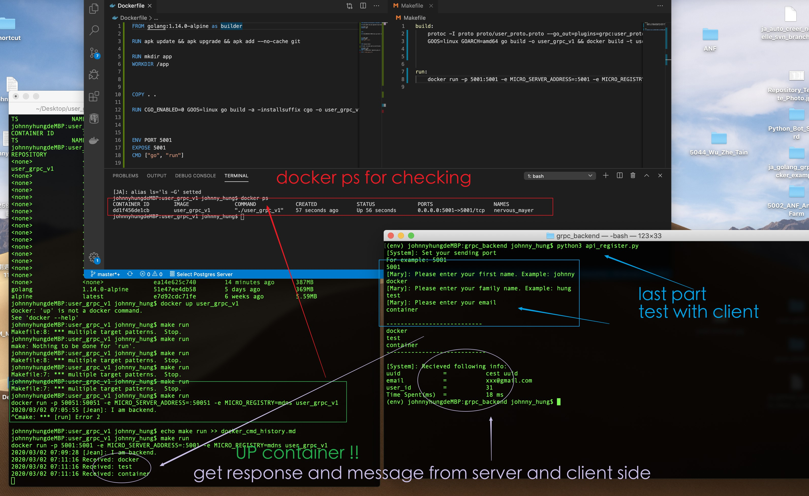
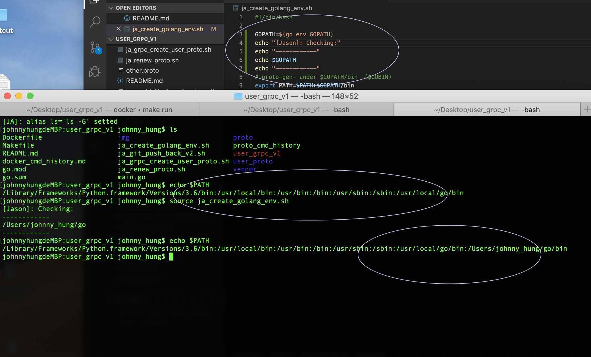

## Outline
---
- [Problem](#problem)
- [Content](#content)

## SOP

---

mkdir user_proto
protoc -I proto proto/user_proto.proto --go_out=plugins=grpc:user_proto

go run main.go 

---

## Easy shell tool
---
source ja_create_golang_env
source ja_grpc_create_user_proto
go run main.go

---

## Test
---
test the communication ok now ✅
---
go run main.go (Running server)
test api_register by pythoon3 (Client)

---
Result:

--- 

## Proto V1.0.2 Tag note:
--- 

 - finish the register api
 - result

 ---

---
- Next 🦜...
- User Service:
    - do the dulplicate email, firstname, famklyname checking
    - implement to add uuid format as discussed.
    - make a correct response to Gate (need error code), back to Mary's proto repository first.

 ---

---

## Docker Test
---
- check docmer_cmd_history.md
- See files 
    - DockerFile 
        - access data copy 
        - go build process
    - Makefile 
        - build part
        - run part

---

Result
---

---

## Key file changed history
----
- modified ja_create_golang_env_sh.sh by Jason
    - check img/ja_create_golang_env_sh_v1_0_1.jpg
---

---

##  Files
--- 
- activate user_service (5001) ✅
    - go run main.go 
- activate gate_server(12345) ✅
    - cd client_grpc_server_test
        - go run main.go 

- client cmd (or you can use post-man)  ✅
    - cd client_grpc_server_test
    - source ja_api.sh
    - source ja_api_by_client_input.sh

----

 

# Task need to Solve
---

- Need to handle auto-incr userid in mongodb first

- uuid later