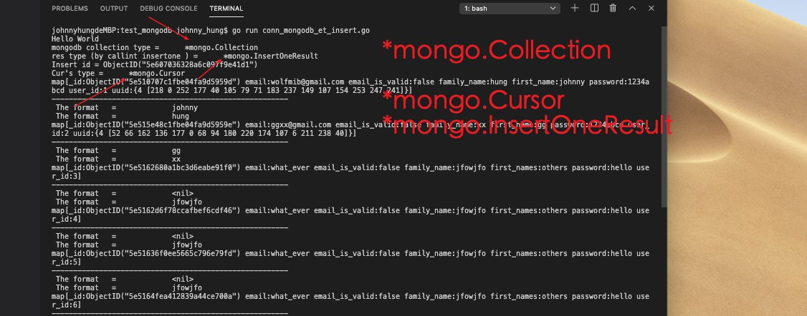

## Golang Package conn Mongo DB Example
---

## Mongo Type (for future implment interface used)
--

---

## File and Result:
---

- conn_mongodb_et_insert.go  ✅
- Result: 

---
 

- Test Query ✅
- ![result][img/query.jpg]

---

- Next, filter 🦜.... under progress... 
- 

---