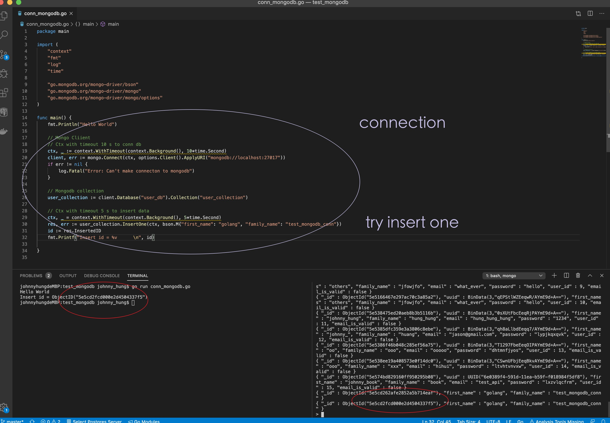

## Golang Package conn Mongo DB Example
---

## File and Result:
---

- conn_mongodb_et_insert.go  ✅
- Result: 
- johnny_example: (done)
    - CreateUser
    - QueryUser by ID, Name
    - Query all Users
    - test_user_db ... collection.  

---
 

- Test Query ✅
- ![result][img/query.jpg]

---

- Next, filter 🦜.... under progress... 
- 

---
